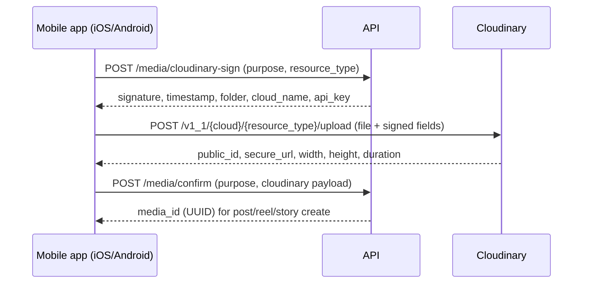

# Cloudinary media storage

All **images and videos** for posts, reels, stories, avatars, and message attachments are stored in **Cloudinary**. Do not use a separate S3 bucket for user media.

## Principles

- **Upload directly from the phone** (iOS/Android app) to the Cloudinary Upload API with **signed parameters** from the backend. Never ship `api_secret` in the app bundle; media bytes never pass through our API servers.
- **Persist metadata** in MongoDB (`public_id`, `resource_type`, `secure_url`, dimensions, duration); Cloudinary is the source of truth for bytes.
- **Deliver** via `secure_url` and transformation URLs (thumbnails, feed sizes, reel vertical crop).

## Environment variables

| Variable | Purpose |
|----------|---------|
| `CLOUDINARY_CLOUD_NAME` | Cloud name |
| `CLOUDINARY_API_KEY` | Server + signed upload params |
| `CLOUDINARY_API_SECRET` | Server only |
| `CLOUDINARY_UPLOAD_PRESET` | Optional unsigned preset (dev only; prefer signed in prod) |

## Folder structure (public_id prefix)

| Purpose | Folder prefix | Example public_id |
|---------|---------------|---------------------|
| Post carousel | `secret/posts/{userId}/` | `secret/posts/uuid/abc123` |
| Reel video | `secret/reels/{userId}/` | `secret/reels/uuid/reel_abc` |
| Story | `secret/stories/{userId}/` | `secret/stories/uuid/story_abc` |
| Avatar | `secret/avatars/{userId}/` | `secret/avatars/uuid/avatar` |
| DM media | `secret/messages/{userId}/` | `secret/messages/uuid/msg_abc` |

## Upload flow (standard)



## Uploading from the device

Implement once as `useCloudinaryUpload()` in `frontend/src/features/media/` and reuse it for posts, reels, stories, avatars, and DMs.

- Send `multipart/form-data` with the file as `{ uri, type, name }` — `uri` is the `file://` (iOS) or `content://` (Android) URI from the picker/camera. Do not read files into base64 or JS memory.
- Add the signed fields (`api_key`, `timestamp`, `signature`, `folder`, plus any signed params) as form fields.
- Show progress with axios `onUploadProgress` (per file, and total for carousels).
- **Large videos (> 20 MB):** use Cloudinary **chunked upload** — 6 MB chunks with `Content-Range` and the same `X-Unique-Upload-Id` header; retry a failed chunk up to 3 times.
- **Images:** resize on device to max 2048 px long edge and JPEG quality ~0.85 before upload (saves mobile data); convert HEIC to JPEG.
- **Network:** warn before uploading > 50 MB on cellular (optional setting "Upload in HD on mobile data"). If the connection drops, keep the draft and offer **Retry**.
- **Backgrounding:** v3 keeps uploads in the foreground with a progress bar on the Home feed ("Posting…"). If the app is killed mid-upload, the draft remains and the user can retry. Background upload service is Phase 2.
- Cancel = abort the request (`AbortController`); no `confirm` call, so nothing is saved.

## API

### `POST /api/v1/media/cloudinary-sign`

**Auth:** Bearer required

**Body:**

```json
{
  "purpose": "post",
  "resource_type": "image",
  "file_name": "photo.jpg"
}
```

`purpose`: `post` | `reel` | `story` | `avatar` | `message`  
`resource_type`: `image` | `video`

**Success `200`:**

```json
{
  "cloud_name": "xxx",
  "api_key": "xxx",
  "timestamp": 1710000000,
  "signature": "...",
  "folder": "secret/posts/user-uuid",
  "resource_type": "video",
  "allowed_formats": ["jpg", "jpeg", "png", "webp", "heic", "mp4", "mov"]
}
```

### `POST /api/v1/media/confirm`

**Body:**

```json
{
  "purpose": "post",
  "public_id": "secret/posts/user-uuid/abc123",
  "resource_type": "image",
  "secure_url": "https://res.cloudinary.com/...",
  "bytes": 102400,
  "width": 1080,
  "height": 1350,
  "duration": null,
  "format": "jpg"
}
```

**Success `201`:** `{ "media_id": "uuid", "secure_url": "...", "public_id": "..." }`

Server verifies signature / ownership of folder prefix before saving.

## Transformations (delivery)

| Use case | Transformation (examples) |
|----------|---------------------------|
| Feed post thumb | `c_fill,w_640,h_640,g_auto,q_auto,f_auto` |
| Post detail / carousel | `q_auto,f_auto` on original aspect |
| Reel playback | `sp_hd`, vertical video `c_fill,w_1080,h_1920` |
| Story fullscreen | `c_fill,w_1080,h_1920,g_auto` |
| Avatar | `c_fill,w_320,h_320,g_face` |

Generate URLs in API responses as `delivery_url` (transformed) and keep `secure_url` (original).

On mobile, always use `f_auto,q_auto` (Cloudinary serves WebP/AVIF/HEVC the device supports). Reels and long videos use adaptive streaming (`sp_hd` → HLS `.m3u8`), which `react-native-video` plays natively on iOS (AVPlayer) and Android (ExoPlayer). Thumbnails/posters use `so_0` frame extraction so the player shows an image before playback starts.

## Video (reels & post video)

- Rely on Cloudinary **eager transformations** or `streaming_profile` for reels after upload (no self-hosted ffmpeg required for MVP).
- Poll `GET /api/v1/media/:mediaId` until `status: "ready"` if processing flag set.

## Deletion

- On post/reel/story **hard delete** or account delete: call Cloudinary Admin API `destroy` for each `public_id` (async job OK).
- Soft-deleted content: keep assets until purge window (30 days) then destroy.

## Security

- Sign uploads with short TTL (≤ 15 minutes).
- Restrict `purpose` so users cannot sign uploads into another user’s folder.
- Max file size enforced in sign endpoint and Cloudinary upload preset.

See [INSTAGRAM_CONTENT_UX.md](INSTAGRAM_CONTENT_UX.md) for create/view/edit flows that consume these assets.
