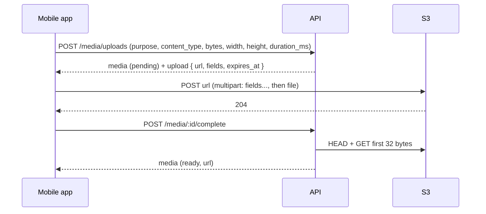
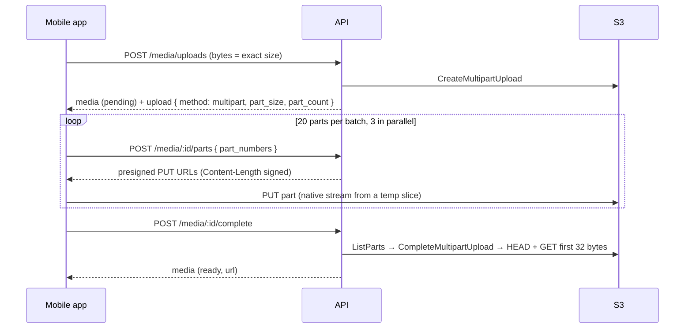

# Media storage (AWS S3)

All **images and videos** for posts, reels, stories, avatars and message attachments are stored in one private-write **AWS S3** bucket and served through **CloudFront** (or the bucket URL during development).

## Principles

- **Upload directly from the phone to S3** with short-lived presigned requests issued by the API. AWS keys never ship in the app, and media bytes never pass through our API servers.
- Files up to **32 MB** use one **presigned POST**. Its policy is enforced **by S3 itself**: exact object key, exact `Content-Type`, and `content-length-range` up to the purpose limit.
- Larger files use a **resumable S3 multipart upload**: 8 MB parts (bigger when a file would need more than 10,000), each sent with a presigned PUT whose `Content-Length` is signed, so S3 rejects any part of another size and the object can never exceed the reserved size. A dropped connection only re-sends the part in flight; a retry resumes from the parts S3 already has.
- After the upload the app calls **complete**. The API checks that the object exists, re-checks the size, and reads the first bytes to verify the real file format (magic bytes). Mismatches are deleted.
- **Persist metadata** in MongoDB (`media_assets`); S3 is the source of truth for bytes.
- Abandoned uploads (reserved but never completed) are purged from S3 and MongoDB every 30 minutes.

## Implementation

| Part | Location |
|------|----------|
| Rules (types, limits per purpose) | `backend/src/modules/media/media.rules.ts` (mirrored in `frontend/src/features/media/mediaRules.ts`) |
| S3 client, presign, multipart, head, delete | `backend/src/modules/media/media.storage.ts` |
| Format sniffing | `backend/src/modules/media/media.sniff.ts` |
| Endpoints | `backend/src/modules/media/media.routes.ts` |
| Cleanup job | `backend/src/modules/media/media.cleanup.ts` |
| Picker + on-device resize | `frontend/src/features/media/pickMedia.ts` (`react-native-image-picker`) |
| On-device compression | `frontend/src/features/media/prepareMedia.ts` (`react-native-compressor`) |
| Upload one file | `frontend/src/features/media/uploadMedia.ts` |
| Resumable multipart (parts, retries) | `frontend/src/features/media/uploadParts.ts` (`react-native-blob-util`) |
| Temp files (slice, size, delete, startup sweep) | `frontend/src/features/media/localFiles.ts` |
| Batch upload hook (progress, cancel, retry/resume) | `frontend/src/features/media/useMediaUpload.ts` |
| Posts, stories and reels upload from the create screens | `frontend/src/features/media/uploadMedia.ts` |

## Environment variables

| Variable | Purpose |
|----------|---------|
| `AWS_REGION` | Bucket region, e.g. `ap-south-1`. Required in production |
| `S3_BUCKET` | Bucket name. Required in production |
| `AWS_ACCESS_KEY_ID`, `AWS_SECRET_ACCESS_KEY` | IAM user limited to this bucket. Leave both empty to use an IAM role |
| `MEDIA_PUBLIC_BASE_URL` | CloudFront domain that serves the bucket, e.g. `https://media.nexity.com`. Empty = presigned S3 GET URLs (valid 6 days, reused for 6 hours) because the bucket blocks public access; fine for development, use CloudFront in production |
| `S3_ENDPOINT` | S3-compatible endpoint for local testing (MinIO / LocalStack). Empty for AWS |
| `MEDIA_UPLOAD_URL_TTL_SECONDS` | Lifetime of a presigned POST or part URL, default `900`. The app fetches fresh part URLs when they run out |

Without `AWS_REGION` + `S3_BUCKET` (development only) the media endpoints return `503 MEDIA_NOT_CONFIGURED`.

## Object keys

`media/{folder}/{userId}/{mediaId}.{ext}` — `folder` is `avatars`, `posts`, `stories`, `reels` or `messages`. Keys are generated by the server; the client cannot choose them. Objects are written with `Cache-Control: public, max-age=31536000, immutable` because a key is never reused.

## Upload flow



Large files (over 32 MB):



After a failure the app resumes with `GET /media/:id/parts` and sends only the missing parts. On a failure that can't be resumed, or on cancel, the app calls `DELETE /media/:id` (best effort, aborts the multipart upload); otherwise the cleanup job removes it.

## Uploading from the device

- Use `pickFromLibrary(purpose, { kind?, limit? })` or `captureWithCamera(purpose, kind)`, then `useMediaUpload(purpose).start(files)`; it resolves with assets in the same order (carousel order).
- The file is sent as `{ uri, type, name }` from its `file://` / `content://` URI — never read into base64 or JS memory. Policy fields go **before** the file (S3 ignores fields after `file`).
- **Images** are resized on the device (long edge: avatar 640, post 1440, story/reel 1920, message 1600) and re-encoded as JPEG at quality 0.8. iOS HEIC is exported as JPEG and MOV as MP4.
- **Edited photos** (Stories canvas, filters): `bakeImage(file, { ratio, transform, matrix })` renders the final photo on the device with Skia — upright copy first (HEIC → JPEG, EXIF rotation applied), then fit over a blurred copy or fill, zoom/pan, filter and adjustments — at most **1080 px wide** (Stories 1080×1920) as JPEG 0.8, then uploads it like any other file.
- **Video** over 10 MB is compressed on the device with `react-native-compressor` (`auto`, MP4) to a long edge of 1920 px (1080p, ~2–3.5 Mbps), or 1280 px (720p) for messages. If compression fails, the original file is used, as long as it is within the size limit.
- **Instagram limits** (`MEDIA_RULES` / `MAX_ITEMS` in both `media.rules.ts` and `mediaRules.ts`):

  | Purpose | Kinds | Max items per pick | Max file size | Max video length |
  |---|---|---|---|---|
  | `avatar` | Photo | 1 | 10 MB | – |
  | `post` | Photo, video | 20 (carousel) | Photo 10 MB, video 200 MB | 2 min per video |
  | `reel` | Video | 1 | 200 MB | 2 min |
  | `story` | Photo, video | 10 | 200 MB | 2 min (photos show for 5 s) |
  | `message` | Photo, video | 10 | Photo 10 MB, video 200 MB | No limit |

  Length is checked after picking (and read from the file when the picker omits it), before compression, with 1 s of tolerance. The camera stops recording at the limit (`durationLimit`). The server rejects a declared `duration_ms` over the limit with `400 MEDIA_TOO_LONG` (`details.max_duration_ms`). Size is checked on the compressed file just before upload ("Photos / Videos can be up to N MB") and again by the server (`400 MEDIA_TOO_LARGE`, `details.max_bytes`) when the upload starts, by S3 during the transfer, and on the stored object at `complete`. Item counts are enforced again by the post, story and message endpoints.
- Progress: processing (images 5%, videos 40%), then the S3 transfer, then 5% verification. `onPhase` reports `processing` / `uploading`. Two files upload in parallel.
- **Large files**: the exact size is read from disk, then each part is cut natively into `CacheDir/nexity-upload/` with `react-native-blob-util` (`fs.slice`) and streamed with `fetch(PUT, url, wrap(path))` — never through JS memory. Each part is retried up to 6 times over about a minute (network errors, 5xx, expired URL → fresh URL). If S3 lost the upload (`UPLOAD_EXPIRED`), the next attempt starts a new one.
- **Retry with backoff**: `POST /media/uploads`, the S3 POST and `complete` are each retried on network errors, `429` and `5xx` after 1, 2, 4 and 8 s (about 15 s) before the file shows as failed.
- **`client_upload_id`**: every file gets a device-generated id (`cu-…`, kept on `UploadItem.clientUploadId`) sent with `POST /media/uploads`. Sending it again for the same file returns the same media (`resumed: true`): a fresh POST for the same key, the same multipart upload (the app then lists parts S3 already has), or `upload.method: "complete"` when it already finished. A different size/type or an expired reservation starts over. Cancelling or a permanent failure releases the id; the next try gets a new one.
- **Resume after an app restart**: before any network work the file is written to an on-disk journal (`DocumentDir/nexity-upload-journal.json`) and the compressed copy is moved to `DocumentDir/nexity-pending-uploads/` (outside the swept cache folders). `useMediaUpload(purpose).resumePending()` finishes this purpose's interrupted uploads without compressing again; `pendingUploads(purpose)` lists them. Entries are removed on success, cancel or a permanent failure, and `sweepUploadJournal()` drops entries older than 24 h (the server reservation) or whose files are gone at startup.
- Cancel aborts the request, releases the reservation and forgets the journal entry; `retryFailed()` re-uploads only failed or cancelled files, **reusing the compressed file and resuming multipart uploads** instead of starting again.
- **Temp files**: part slices are deleted right after each part; the compressed copy is deleted when the upload succeeds, or when the batch is replaced, `reset()`, or the screen unmounts. Originals in the gallery are never deleted. At startup `sweepUploadCache()` removes leftovers from earlier launches (Android cache: picker `rn_image_picker_lib_temp_*` and compressor `<uuid>.<ext>` files; iOS: media files in the app `tmp/`). Files from the current launch are never touched, so future drafts must be saved outside these folders.

## API

All endpoints require a Bearer token and only ever return the caller's own media.

### `POST /api/v1/media/uploads`

Rate limit: 150 per 15 minutes per account; at most 30 unfinished uploads at once (`429 TOO_MANY_PENDING_UPLOADS`).

```json
{ "purpose": "post", "content_type": "image/jpeg", "bytes": 482113, "width": 1080, "height": 1350 }
```

`width`, `height` and `duration_ms` are optional hints; invalid values are dropped, never rejected. `client_upload_id` (optional, `[\w-]{8,64}`, unique per owner) makes the call idempotent: for the same file it returns the existing media with `"resumed": true` and either a new presigned POST for the same key, the existing multipart ticket, or `{ "method": "complete" }` when the media is already `ready`. Two concurrent calls with the same id get the same media.

**`201`**

```json
{
  "media": { "id": "…", "purpose": "post", "kind": "image", "status": "pending", "url": null, "content_type": "image/jpeg", "bytes": 482113, "width": 1080, "height": 1350, "duration_ms": null, "created_at": "…" },
  "upload": { "url": "https://bucket.s3.ap-south-1.amazonaws.com/", "fields": { "key": "…", "Policy": "…", "X-Amz-Signature": "…" }, "expires_at": "…" }
}
```

Errors: `VALIDATION_ERROR` (unsupported type), `MEDIA_KIND_NOT_ALLOWED`, `MEDIA_TOO_LARGE` (`details.max_bytes`), `MEDIA_TOO_LONG` (`details.max_duration_ms`), `MEDIA_NOT_CONFIGURED` (503).

### `POST /api/v1/media/:id/complete`

**`200`** the media with `status: "ready"` and `url`. Idempotent. Errors: `UPLOAD_NOT_FOUND`, `MEDIA_TOO_LARGE`, `INVALID_MEDIA` (content doesn't match the declared type; the object is deleted).

### `GET /api/v1/media/:id` · `DELETE /api/v1/media/:id`

Read or delete (S3 object + row, `204`). Content modules must stop deleting media that is attached to a post, story, reel or message once those modules exist.

## Limits

See [TECH_STACK.md](TECH_STACK.md#media-limits-default). Server and app share the same table.

## Delivery

- `url` = `MEDIA_PUBLIC_BASE_URL` + key, or a presigned GET URL when it is empty (`viewUrl()` in `media.storage.ts`). Store the S3 **key** (e.g. `User.avatar_key`), never the URL, and build the URL per response. Use CloudFront in production (HTTPS, caching, lower egress cost).
- S3 has no on-the-fly transformations. Images are already resized on the device; feed thumbnails and video posters are generated on the device when the post/reel is created and uploaded as separate media.
- Videos play as progressive MP4 with `react-native-video`. Adaptive streaming (AWS MediaConvert → HLS) is a later improvement.

## AWS setup (one time)

1. **Bucket**: S3 → Create bucket in `ap-south-1` (or your region). Keep **Block all public access** on. Default encryption SSE-S3. No CORS rule is needed for the native app (CORS only applies to browsers).
2. **CloudFront**: create a distribution with the bucket as origin using **Origin Access Control**, and accept the bucket policy CloudFront suggests. Put its domain (or your custom domain) in `MEDIA_PUBLIC_BASE_URL`.
   - Without CloudFront (development only): turn off "Block public access" and add a bucket policy allowing `s3:GetObject` on `arn:aws:s3:::<bucket>/media/*`.
3. **IAM**: create a user (or role for the server) with only this policy, then put its keys in `backend/.env`:

```json
{
  "Version": "2012-10-17",
  "Statement": [
    {
      "Effect": "Allow",
      "Action": ["s3:PutObject", "s3:GetObject", "s3:DeleteObject", "s3:AbortMultipartUpload", "s3:ListMultipartUploadParts"],
      "Resource": "arn:aws:s3:::<bucket>/media/*"
    },
    {
      "Effect": "Allow",
      "Action": "s3:ListBucket",
      "Resource": "arn:aws:s3:::<bucket>",
      "Condition": { "StringLike": { "s3:prefix": ["media/*"] } }
    }
  ]
}
```

Without `s3:ListBucket`, S3 answers `403` instead of `404` for a missing object, so "file not received" checks fail with a server error instead of `UPLOAD_NOT_FOUND`.

4. Optional: a lifecycle rule to abort incomplete multipart uploads after 1 day.
5. Optional safety net: a lifecycle rule expiring objects under `media/stories/` after 2 days. S3 lifecycle works in whole days, so the API's own cleanup (below) is what removes stories on time.

## Story expiry

Stories live for **24 hours** (`expires_at = created_at + 24 h`). From that moment every story endpoint treats them as gone (tray, view, like, message, vote, reply and viewers return `404` or leave them out), and the app drops them from the tray every minute without a refresh.

The API process runs `purgeExpiredStories` every **5 minutes** (`backend/src/modules/stories/story.cleanup.ts`, started with the server). For each expired story it deletes the file from S3, then the media row, views, likes, poll votes, question answers and story messages, and the story last, so a failure is retried on the next run. It also deletes story uploads older than 24 hours that never became a story. Deleting a story by hand removes its S3 file the same way. Signed view URLs stop working once the object is gone.

## Security

- Presigned POST lifetime ≤ 15 minutes; key, type and max size are part of the signed policy.
- Users can only read, complete or delete their own media (`404` otherwise).
- Keys are unguessable, but URLs are public once known. Private-account media protection (CloudFront signed URLs) is a later improvement.
- EXIF/GPS: on-device re-encoding is not guaranteed to drop location metadata. Stripping it (on device or in a post-upload step) must be added before posts ship.
